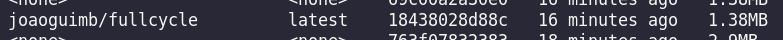

# Docker Full Cycle

## First Challenge

The first challenge of the Full Cycle Course is to create a go image with less than 2MB. I achieved it by using a Multistage approach, the image can be found in the directory ./go.

The image was also published on Docker Hub and can be used by running:

```
docker pull joaoguimb/fullcycle
```

This image has 1.38MB



# Second Challenge

The resolution of the second challenge can be found on /nginx-node directory
